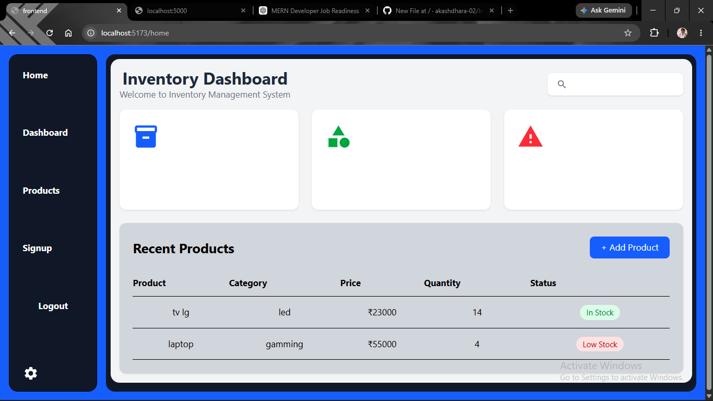
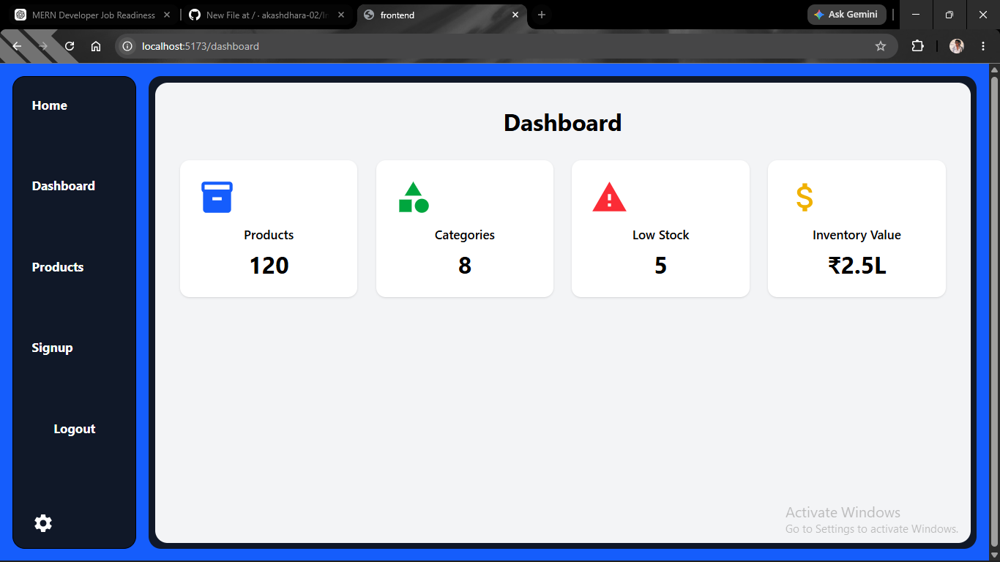
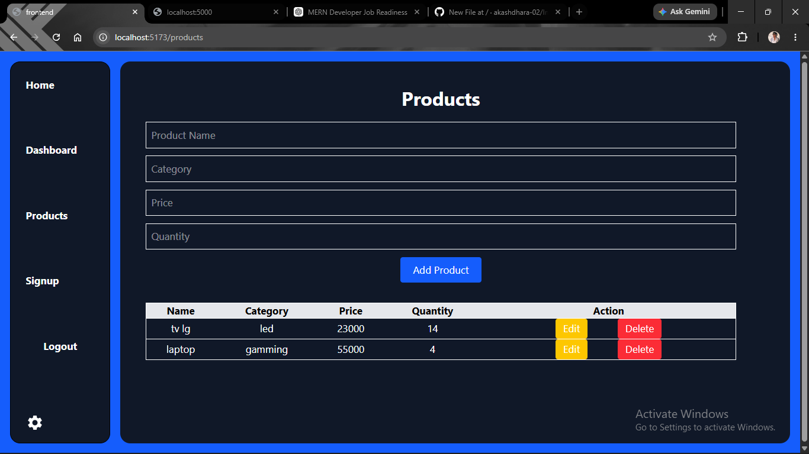

# Screenshots

## Home



## Dashboard



## Products




## Signup


# 📦 Inventory Management System

A simple MERN Stack Inventory Management System built using React, Node.js, Express.js, and MongoDB.

## 🚀 Features

- User Signup
- User Login
- Add Product
- View Products
- Update Product
- Delete Product
- Dashboard
- Product Statistics
- Responsive UI

## 🛠️ Tech Stack

### Frontend
- React.js
- React Router
- Axios
- Tailwind CSS

### Backend
- Node.js
- Express.js
- MongoDB
- Mongoose

## 📸 Screenshots

### Dashboard


### Products


### Login


### Signup


## ⚙️ Installation

```bash
git clone https://github.com/akashdhara-02/Inventory-Management.git
```

```bash
cd Inventory-Management
```

### Backend

```bash
cd Backend
npm install
npm run dev
```

### Frontend

```bash
cd Frontend
npm install
npm run dev
```

## 👨‍💻 Author

Akash Dhara